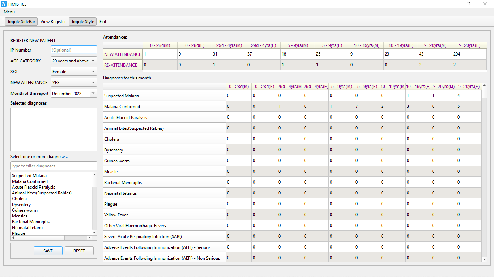

# HMIS

Store patient records and generate a monthly HMIS 105 report for your medical facility.



This software is meant to help you aggregate data for attendances and diagnoses only. 
It is not a complete hospital management system.

If you are interested in a complete hospital system, [send me an email](mailto:nabiira2by2@gmail.com).

## Features
- [x] Register Patients with Serial No, Sex, Age range and one or more diagnoses.
- [x] Auto-generate HMIS 105 report for attendances and diagnoses
- [x] View stored report depending on the selected month.
- [x] Register new diagnoses (even those not on standard HMIS 105 forms)
- [x] Use **sqlite3**, **mysql** or **postgresql** databases.
- [x] Ready to use Installers for the Windows x64 and Linux x64 app image.

## Installation:
1. Download the latest installer for windows from the releases page at https://github.com/abiiranathan/hmis/releases or the linux archive that contains the .AppImage.

#Dependencies
The Linux App image requires libfuse to run.
Install with:

```bash
sudo apt install libfuse2
```

On archlinux, install with:
```bash
sudo pacman -S fuse2
```
   

## Database configuration
HMIS supports 3 database drivers.

### Configuring sqlite3

sqlite3 is the default driver. A database called **hmis.sqlite3** will be created in the HOME directory. The name is not customizable.

### Configuring Postgres database
You need to set environment variables for the driver and postgres connection options.

On windows, you set the environment variables in settings.
Below are variables to be set.
```txt
PGDATABASE=hmis            # The database name to connect to
PGUSER=postgres_user       # replace with connecting user      
PGPASSWORD=password        # replace with password of user
PGHOST=127.0.1             # This is the default and can be skipped.
PGPORT=5432                # This is the default and can be skipped.
HMIS_DB_DRIVER=postgresql  # MUST be set for us to use postgres.
```

### Configuring mysql database
You need to set environment variables for the driver and mysql connection options.

On windows, you set the environment variables in settings.
Below are variables to be set.
```txt
MYSQL_DATABASE=hmis       # The database name to connect to.
MYSQL_HOST=postgres_user  # replace with connecting user      
MYSQL_USER=password       # replace with password of user
MYSQL_PASSWORD=127.0.1    # This is the default and can be skipped.
MYSQL_PORT=3306           # This is the default and can be skipped.
HMIS_DB_DRIVER=mysql      # MUST be set for us to use mysql.
```

---
### Features to be implemented.
* Charts for attendence statistics, diagnoses.
* Integrated HAART register and reports.
* Antenatal register and reports.
* User authentication.

---

Feel free to submit pull requests and file bugs.

<center style="display: flex; gap: 1rem;">
Technology: Qt6

|

Language: C++

</center>
