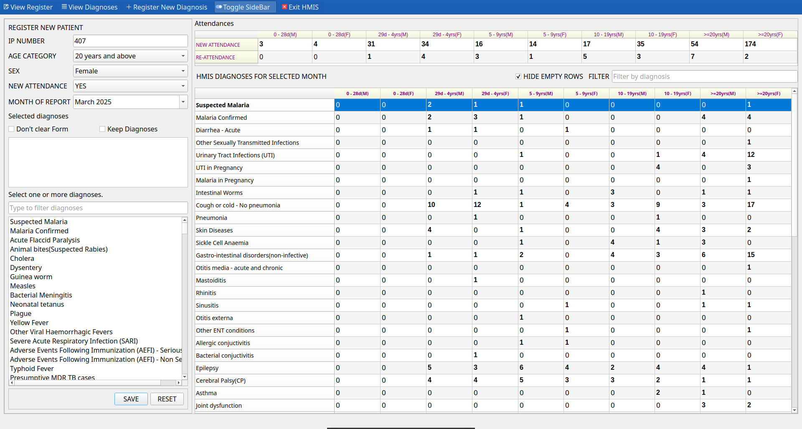
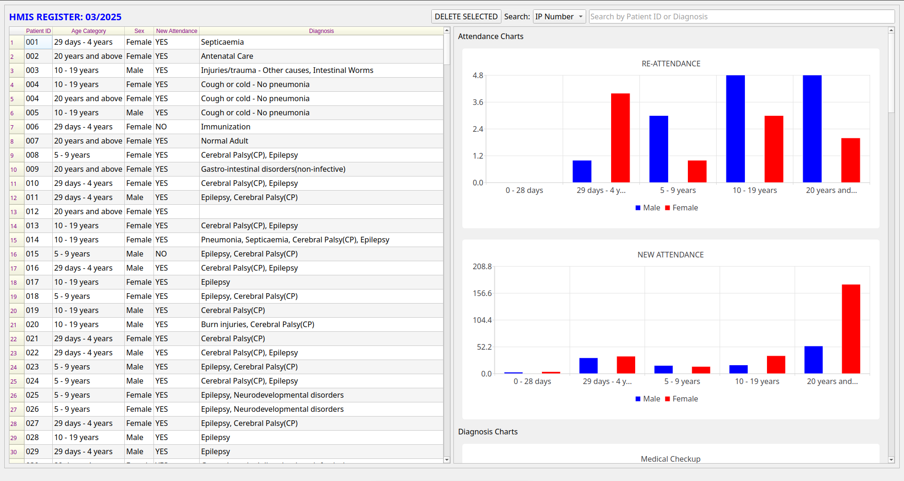

# HMIS

Store patient records and generate a monthly HMIS 105 report for your medical facility.




This software is meant to help you aggregate data for attendances and diagnoses only.
It is not a complete hospital management system.

If you are interested in a complete hospital system, check out **[Eclinic HMS](https://abiiranathan.github.io/eclinichms)** and send me an email at **nabiira2by2@gmail.com**.

## Features

- [x] Register Patients with Serial No, Sex, Age range and one or more diagnoses.
- [x] Auto-generate HMIS 105 report for attendances and diagnoses
- [x] View stored report depending on the selected month.
- [x] Register new diagnoses (even those not on standard HMIS 105 forms)
- [x] Use **sqlite3**, **mysql** or **postgresql** databases.
- [x] Ready to use Installers for the Windows x64 and Linux x64 app image.

## Installation:

1. Download the latest installer for windows from the releases page at https://github.com/abiiranathan/hmis/releases or the linux archive that contains the .AppImage.

## Dependencies

The Linux App image requires libfuse to run.

Install with:

```bash
sudo apt install libfuse2
```

On archlinux, install with:

```bash
sudo pacman -S fuse2
```

> On windows, you must install the C++ runtime DLLs from Microsoft.
> Click here [https://aka.ms/vs/17/release/vc_redist.x64.exe](https://aka.ms/vs/17/release/vc_redist.x64.exe) to download it, then run it. It will install the requred dlls.

⸻

## 🛠 macOS Installation Guide for HMIS

This guide outlines how to build and run the HMIS application on macOS from source.

### 📋 Prerequisites

Ensure the following tools are installed:

- [Homebrew](https://brew.sh/)

  ```bash
  /bin/bash -c "$(curl -fsSL https://raw.githubusercontent.com/Homebrew/install/HEAD/install.sh)"

  •	Qt (for GUI support):
  ```

brew install qt

    •	CMake (build system generator):

brew install cmake

    •	Xcode Command Line Tools:

xcode-select --install

⸻

🚀 Build Steps 1. Clone the Repository:

git clone https://github.com/abiiranathan/hmis.git
cd hmis

    2.	Create and Enter the Build Directory:

mkdir build
cd build

    3.	Configure the Project with CMake:

If you installed Qt with Homebrew, your Qt path will likely be:
/opt/homebrew/opt/qt

Run:

cmake .. -DCMAKE_PREFIX_PATH=$(brew --prefix qt)

    4.	Build the Application:

make

⸻

✅ Running the Application

After a successful build, a macOS app bundle will be generated as:

build/HMIS.app

You can run it via:

open HMIS.app

Or directly from the terminal:

./HMIS.app/Contents/MacOS/HMIS

⸻

📦 Optional: Install to Applications

To move the app to your system’s Applications folder:

cp -R HMIS.app /Applications/

Then launch via Spotlight or Finder.

⸻

🧰 Troubleshooting
• App doesn’t open or crashes:
• Ensure all Qt dependencies are bundled correctly.
• Run the binary directly to see errors:

./HMIS.app/Contents/MacOS/HMIS

    •	Missing Qt plugins (e.g., libqcocoa.dylib):
    •	Use macdeployqt (from Qt) to bundle missing dependencies:

/opt/homebrew/opt/qt/bin/macdeployqt HMIS.app

## Database configuration

HMIS supports 3 database drivers.

### Configuring sqlite3

sqlite3 is the default driver. A database called **hmis.sqlite3** will be created in the HOME directory. The name is not customizable.

### Configuring Postgres database

You need to set environment variables for the driver and postgres connection options.

On windows, you set the environment variables in settings.
Below are variables to be set.

```txt
PGDATABASE=hmis            # The database name to connect to
PGUSER=postgres_user       # replace with connecting user
PGPASSWORD=password        # replace with password of user
PGHOST=127.0.1             # This is the default and can be skipped.
PGPORT=5432                # This is the default and can be skipped.
HMIS_DB_DRIVER=postgresql  # MUST be set for us to use postgres.
```

### Configuring mysql database

You need to set environment variables for the driver and mysql connection options.

On windows, you set the environment variables in settings.
Below are variables to be set.

```txt
MYSQL_DATABASE=hmis       # The database name to connect to.
MYSQL_HOST=postgres_user  # replace with connecting user
MYSQL_USER=password       # replace with password of user
MYSQL_PASSWORD=127.0.1    # This is the default and can be skipped.
MYSQL_PORT=3306           # This is the default and can be skipped.
HMIS_DB_DRIVER=mysql      # MUST be set for us to use mysql.
```

---

### Features to be implemented.

- Charts for attendence statistics, diagnoses.
- Integrated HAART register and reports.
- Antenatal register and reports.
- User authentication.

---

Feel free to submit pull requests and file bugs.

<center style="display: flex; gap: 1rem;">
Technology: Qt6

|

Language: C++

</center>
